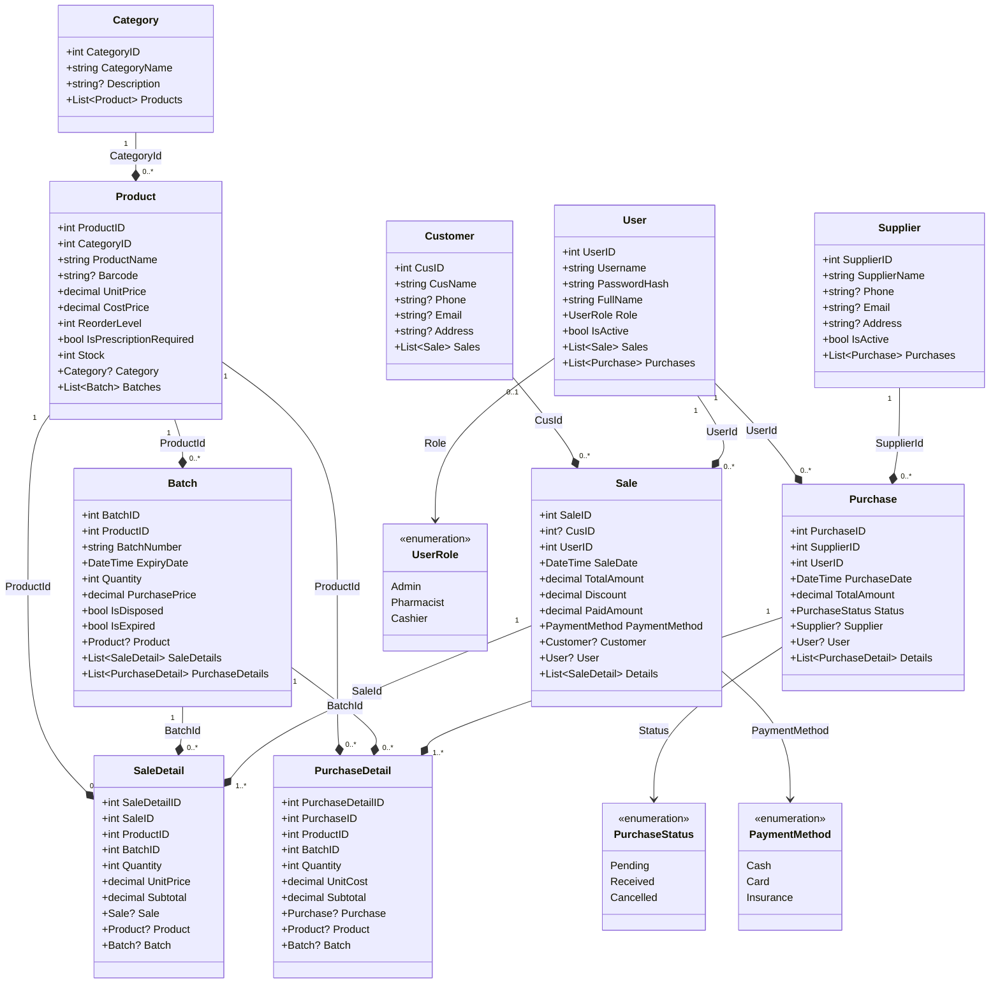

# UML Class Diagrams — PharmacyMS

Three views: domain data, OOP layers, runtime wiring.

**Legend**

| Arrow | Meaning |
|---|---|
| `--*` | composition (has-a) |
| `<\|..` | implements |
| `<\|--` | inherits |
| `-->` | uses / calls |

---

## View 1 — Domain / entities

---

## View 2 — OOP layers

```mermaid
classDiagram
    class IRepository~T~ {
        <<interface>>
        +GetByIdAsync(int) Task~T?~
        +GetAllAsync() Task~List~T~~
        +FindAsync(predicate) Task~List~T~~
        +AddAsync(T) Task
        +AddRangeAsync(IEnumerable~T~) Task
        +Update(T) void
        +Remove(T) void
        +CountAsync(predicate?) Task~int~
    }
    class IProductRepository {
        <<interface>>
        +GetByBarcodeAsync(string) Task~Product?~
        +SearchAsync(string) Task~List~Product~~
        +GetWithStockAsync() Task~List~Product~~
    }
    class IBatchRepository {
        <<interface>>
        +GetByProductAsync(int) Task~List~Batch~~
        +GetFefoCandidatesAsync(int,DateTime) Task~List~Batch~~
        +GetExpiringAsync(DateTime,DateTime) Task~List~Batch~~
        +GetExpiredAsync(DateTime) Task~List~Batch~~
        +GetTotalStockAsync(int) Task~int~
    }
    class ISaleRepository {
        <<interface>>
        +GetWithDetailsAsync(int) Task~Sale?~
        +GetByDateRangeAsync(DateTime,DateTime) Task~List~Sale~~
        +GetRecentAsync(int) Task~List~Sale~~
    }
    class IPurchaseRepository {
        <<interface>>
        +GetWithDetailsAsync(int) Task~Purchase?~
        +GetRecentAsync(int) Task~List~Purchase~~
    }
    class IUserRepository {
        <<interface>>
        +GetByUsernameAsync(string) Task~User?~
    }
    class IUnitOfWork {
        <<interface>>
        +SaveChangesAsync(CancellationToken) Task~int~
        +ExecuteInTransactionAsync(Func~Task~) Task
    }
    class IAuthService {
        <<interface>>
        +LoginAsync(string,string) Task~Result~User~~
        +CreateUserAsync(User,string) Task~Result~int~~
        +UpdateUserAsync(User,string?) Task~Result~int~~
    }
    class ISaleService {
        <<interface>>
        +GetRecentAsync(int) Task~Result~List~Sale~~~
        +GetByIdAsync(int) Task~Result~Sale?~~
        +CheckoutAsync(CheckoutDto) Task~Result~int~~
    }
    class IPurchaseService {
        <<interface>>
        +GetRecentAsync(int) Task~Result~List~Purchase~~~
        +GetByIdAsync(int) Task~Result~Purchase?~~
        +CreateAsync(PurchaseCreateDto) Task~Result~int~~
    }
    class IBatchService {
        <<interface>>
        +GetAllAsync() Task~Result~List~Batch~~~
        +GetExpiryAlertsAsync() Task~Result~List~Batch~~~
        +DisposeAsync(int) Task~Result~int~~
        +FlagExpiredAsync() Task~Result~int~~
    }
    class IReportService {
        <<interface>>
        +GetSalesReportAsync(DateTime,DateTime) Task~Result~List~Sale~~~
        +GetStockReportAsync() Task~Result~List~Product~~~
        +GetProfitReportAsync(DateTime,DateTime) Task~Result~List~ProfitRow~~~
    }
    class IDashboardService {
        <<interface>>
        +GetAsync() Task~Result~DashboardDto~~
    }

    class Repository~T~ {
        #AppDbContext _db
        #DbSet~T~ _set
        +GetByIdAsync(int) Task~T?~
        +GetAllAsync() Task~List~T~~
        +AddAsync(T) Task
        +Update(T) void
        +Remove(T) void
    }
    class ProductRepository
    class BatchRepository
    class SaleRepository
    class PurchaseRepository
    class UserRepository
    class UnitOfWork {
        -AppDbContext _db
        +SaveChangesAsync(CancellationToken) Task~int~
        +ExecuteInTransactionAsync(Func~Task~) Task
    }
    class AuthService
    class SaleService
    class PurchaseService
    class BatchService
    class ReportService
    class DashboardService
    class AppDbContext {
        +DbSet~Category~ Categories
        +DbSet~Product~ Products
        +DbSet~Supplier~ Suppliers
        +DbSet~Customer~ Customers
        +DbSet~User~ Users
        +DbSet~Purchase~ Purchases
        +DbSet~PurchaseDetail~ PurchaseDetails
        +DbSet~Sale~ Sales
        +DbSet~SaleDetail~ SaleDetails
        +DbSet~Batch~ Batches
    }
    class BaseForm {
        <<inherits Form>>
        +Alert(string)
        +Warn(string)
        +Confirm(string) bool
        +MakeButton(string) Button
    }
    class Form~.. 24 forms ..~

    IRepository~T~ <|.. Repository~T~
    IProductRepository <|.. ProductRepository
    IBatchRepository <|.. BatchRepository
    ISaleRepository <|.. SaleRepository
    IPurchaseRepository <|.. PurchaseRepository
    IUserRepository <|.. UserRepository
    IUnitOfWork <|.. UnitOfWork
    IAuthService <|.. AuthService
    ISaleService <|.. SaleService
    IPurchaseService <|.. PurchaseService
    IBatchService <|.. BatchService
    IReportService <|.. ReportService
    IDashboardService <|.. DashboardService

    IRepository~Product~ <|.. IProductRepository
    IRepository~Batch~ <|.. IBatchRepository
    IRepository~Sale~ <|.. ISaleRepository
    IRepository~Purchase~ <|.. IPurchaseRepository
    IRepository~User~ <|.. IUserRepository

    Repository~T~ <|-- ProductRepository
    Repository~T~ <|-- BatchRepository
    Repository~T~ <|-- SaleRepository
    Repository~T~ <|-- PurchaseRepository
    Repository~T~ <|-- UserRepository

    Repository~T~ *-- AppDbContext
    UnitOfWork *-- AppDbContext
    AuthService *-- IUserRepository
    AuthService *-- IUnitOfWork
    SaleService *-- ISaleRepository
    SaleService *-- IProductRepository
    SaleService *-- IBatchRepository
    SaleService *-- IUnitOfWork
    PurchaseService *-- IPurchaseRepository
    PurchaseService *-- IProductRepository
    PurchaseService *-- IBatchRepository
    PurchaseService *-- IUnitOfWork
    BatchService *-- IBatchRepository
    BatchService *-- IProductRepository
    BatchService *-- IUnitOfWork
    ReportService *-- ISaleRepository
    ReportService *-- IProductRepository
    DashboardService *-- ISaleRepository
    DashboardService *-- IProductRepository
    DashboardService *-- IBatchRepository

    Form <|-- BaseForm
    BaseForm <|-- Form~.. 24 forms ..~
```

---

## View 3 — Runtime wiring

```mermaid
classDiagram
    class AppServices {
        <<static composition root>>
        +AppDbContext Db
        +IAuthService Auth
        +ISaleService Sales
        +IPurchaseService Purchases
        +IBatchService Batches
        +IReportService Reports
        +IDashboardService Dashboard
        +IProductRepository ProductRepo
        +IRepository~Category~ CategoryRepo
        +IRepository~Supplier~ SupplierRepo
        +IRepository~Customer~ CustomerRepo
        +IUserRepository UserRepo
        +InitAsync(string cs) Task
    }
    class Program {
        +Main() void
        -RunApp() Form
        -ConnectionString() string
    }
    class FrmLogin {
        +LoggedInUser User?
    }
    class FrmMain {
        -User _user
        +ShowDashboard() void
        +OpenDashboardCard(int) void
    }
    class UcDashboardCard {
        +CardOpened Action~int~?
        +RefreshAsync() Task
    }
    class FrmPos {
        -ISaleService _sales
        -IProductRepository _products
        -IRepository~Customer~ _customers
        -User _user
    }
    class FrmPurchaseList {
        -IPurchaseService _purchases
    }
    class FrmPurchaseNew {
        -IPurchaseService _purchases
        -IProductRepository _products
        -IRepository~Supplier~ _suppliers
        -IRepository~Category~ _categories
        -User _user
    }
    class FrmProductList {
        -IProductRepository _products
        -IRepository~Category~ _categories
    }
    class FrmBatchList {
        -IBatchService _batches
    }
    class FrmUserList {
        -IUserRepository _users
        -IAuthService _auth
    }
    class FrmSalesReport {
        -IReportService _reports
        -ISaleService _sales
    }
    class FrmStockReport {
        -IReportService _reports
    }
    class FrmProfitReport {
        -IReportService _reports
    }
    class FrmExpiryReport {
        -IBatchService _batches
    }
    class FrmCategoryList {
        -IRepository~Category~ _categories
    }
    class FrmSupplierList {
        -IRepository~Supplier~ _suppliers
    }
    class FrmCustomerList {
        -IRepository~Customer~ _customers
    }
    class DbSeeder {
        <<static>>
        +SeedAsync(AppDbContext) Task
    }

    Program --> AppServices : InitAsync
    Program --> FrmLogin : ShowDialog
    Program --> FrmMain : after login
    AppServices --> DbSeeder : first run
    AppServices --> AppDbContext : EnsureCreated
    AppServices --> AuthService
    AppServices --> SaleService
    AppServices --> PurchaseService
    AppServices --> BatchService
    AppServices --> ReportService
    AppServices --> DashboardService
    AppServices --> Repositories : 6 repos + UoW

    FrmLogin --> AppServices : Auth static
    FrmMain --> UcDashboardCard
    FrmMain --> AppServices : Sales/Reports/Batches/Repos
    UcDashboardCard --> AppServices : Dashboard static

    FrmPos --> ISaleService
    FrmPos --> IProductRepository
    FrmPos --> IRepository~Customer~
    FrmPurchaseList --> IPurchaseService
    FrmPurchaseNew --> IPurchaseService
    FrmPurchaseNew --> IProductRepository
    FrmPurchaseNew --> IRepository~Supplier~
    FrmPurchaseNew --> IRepository~Category~
    FrmProductList --> IProductRepository
    FrmProductList --> IRepository~Category~
    FrmBatchList --> IBatchService
    FrmUserList --> IUserRepository
    FrmUserList --> IAuthService
    FrmSalesReport --> IReportService
    FrmSalesReport --> ISaleService
    FrmStockReport --> IReportService
    FrmProfitReport --> IReportService
    FrmExpiryReport --> IBatchService
    FrmCategoryList --> IRepository~Category~
    FrmSupplierList --> IRepository~Supplier~
    FrmCustomerList --> IRepository~Customer~
```

